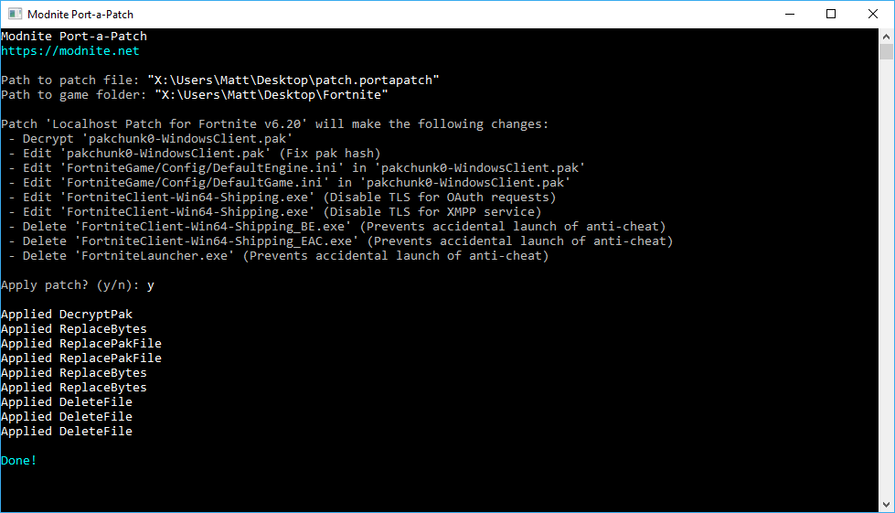

# Modnite Patcher
An easy and secure way to patch game files.



## In Development
* GUI
* Add new files to the game folder
* Auto-create patches
* Security enhancements

## Applying a Patch
1. Copy the entire game folder. Modnite Patcher does not create a backup.
2. Launch the application.
3. Enter the path to a patch zip file.
4. Enter the path to the folder you created in step 1.
5. Read the expected actions carefully.
6. Enter `y` to apply the patches, or `n` to cancel.

## Creating a Patch
The easiest way to learn is to look at a real patch. Download the Localhost Patch for v6.21 [in the samples folder](/samples), change the extension to zip and open it to see how Port-a-Patch patches are structured.

1. Create a file called `manifest.json`
2. Use this template:
```
{
    "Name": "Patch description (e.g. Localhost Patch for v6.21)",
    "Version": 1,
    "Patches": []
}
```
3. Add one or more of the patch actions below to `Patches`.
4. Create an empty zip file
5. Put the manifest file into the zip.
6. Put all files you want to insert into paks in the zip.
7. Distribute the `.zip` file.

### Patch Actions

| Property      | Type          | Required? | Comments      |
| ------------- | ------------- | --------- | ------------- |
| PatchType     | Enum          | Yes       | See PatchType enum below |
| Description   | String        | No        |               |

#### DecryptPak
Decrypts a pak chunk with the given encryption key.

| Property      | Type          | Required? | Comments      |
| ------------- | ------------- | --------- | ------------- |
| Chunk         | String        | Yes       | The name of the pak chunk without the `.pak` file extension |
| Key           | String        | Yes       | The encryption key as a hex string (may be prefixed with `0x`) |

#### ReplaceBytes
Replaces a set of bytes in an exe or pak chunk.

| Property      | Type          | Required? | Comments      |
| ------------- | ------------- | --------- | ------------- |
| GameFile      | Enum          | Yes       | The game file to edit (or `PakFile`) |
| Chunk         | String        | Yes, if `GameFile` == `PakFile` | The name of the pak chunk without the `.pak` file extension |
| SeekOrigin    | Enum          | Yes       | If `Begin`, the `Offset` is an absolute file position. If `End`, the offset is relative to the end of the file |
| Offset        | int64         | Yes       | The offset in the file |
| OriginalBytes | String        | Yes       | A hex string containing the original bytes that are expected at the location. If the bytes does not match the bytes in the file, then this action will be skipped |
| NewBytes      | String        | Yes       | A hex string containing the new bytes to apply at the `Offset` |

#### ReplacePakFile
Swaps a file in a decrypted pak chunk with the new one in the zip.

| Property      | Type          | Required? | Comments      |
| ------------- | ------------- | --------- | ------------- |
| Chunk         | String        | Yes       | The name of the pak chunk without the `.pak` file extension |
| FileName      | String        | Yes       | The name of the file in the pak chunk |
| ReplacementFileName | String  | Yes       | The name of the new file in the zip |
| Padding       | Enum          | Yes       | If the new file is smaller than the original file, pad the new file with either `Spaces` or `NullBytes`. |

#### DeleteFile
Deletes a `GameFile`.

| Property      | Type          | Required? | Comments      |
| ------------- | ------------- | --------- | ------------- |
| GameFile      | Enum          | Yes       | The game file to delete |

### Enums

#### GameFile

| Name | Value | 
| ---- | ----- |
| GameExecutable | `FortniteClient-Win64-Shipping.exe` |
| BEExecutable | `FortniteClient-Win64-Shipping_BE.exe` |
| EACExecutable | `FortniteClient-Win64-Shipping_EAC.exe` |
| FortniteLauncher | `FortniteLauncher.exe` |

#### PatchType
```
DecryptPak
ReplacePakFile
ReplaceBytes
DeleteFile
```

## Logo Attribution
Icons made by [Freepik](http://www.freepik.com) from [www.flaticon.com](https://www.flaticon.com/) is licensed by [CC 3.0 BY](http://creativecommons.org/licenses/by/3.0/)
